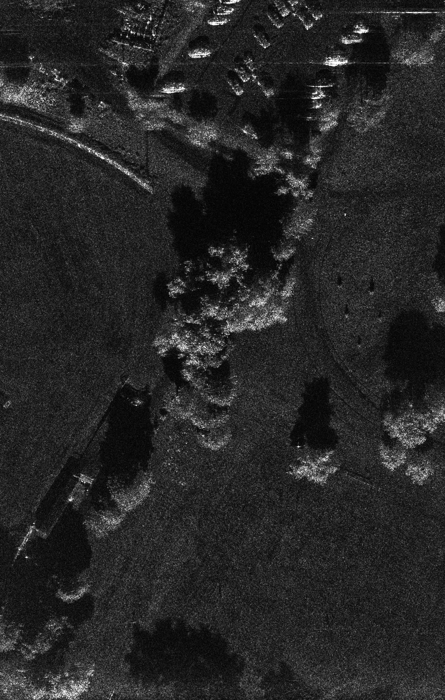
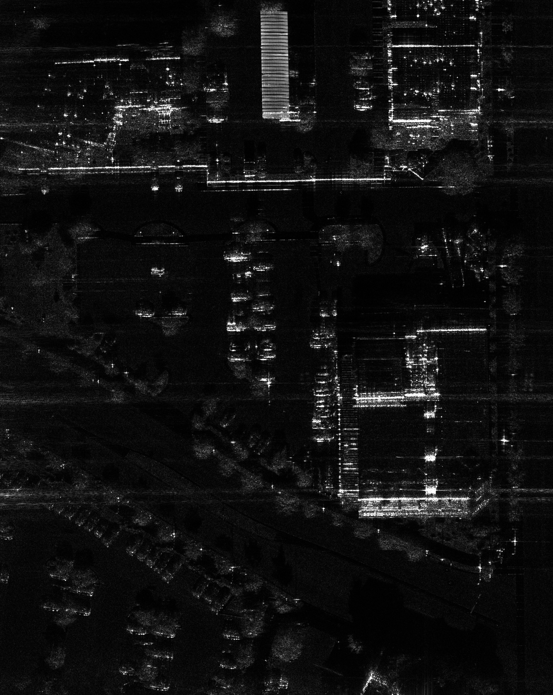
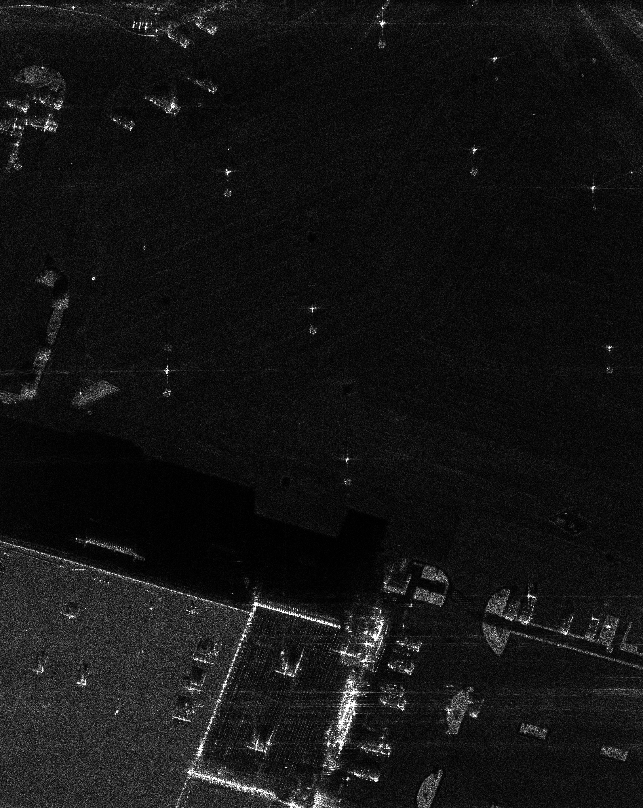
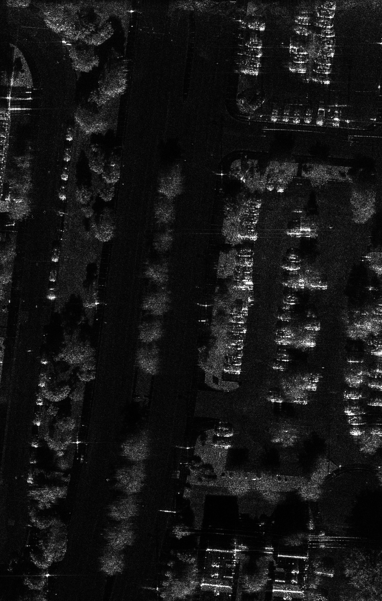

# SAR_vehicle_detection_dataset
We collected 104 high-resolution SAR images from Sandia MiniSAR and FARAR SAR images, and established a dataset containing 2958 vehicle targets for vehicle detection in high-resolution SAR images.

# Update
2019.12.20 The dataset, including SAR images and label files will be uploaded soon afterwards. 

# Dataset information
  | Data Source | Resolution |Number of Images| Number of vehicles|
  | --------    | -----      | ----           | ----              | 
  | MiniSAR Ku-band|4 inches| 15 |662|
  | FARAD SAR Ka-band|4 inches|  38    |1153|
  | FARAD SAR X-band|4 inches|  51   |1143|
  
# Image samples of the dataset
## MiniSAR

## FARAD SAR Ka-band

## FARAD SAR X-band

